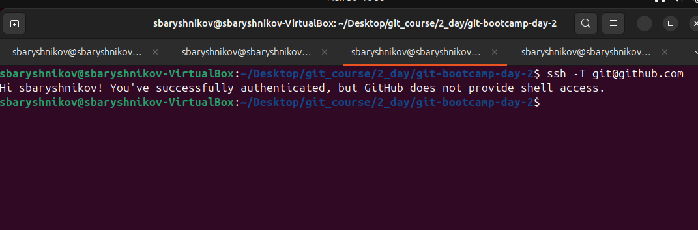
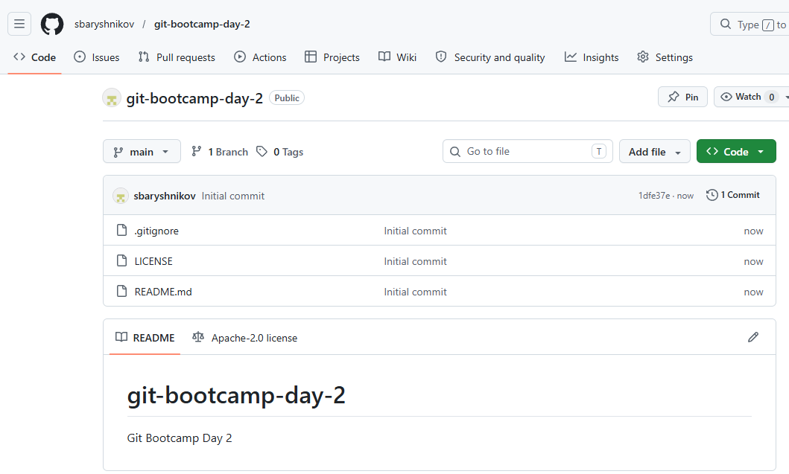
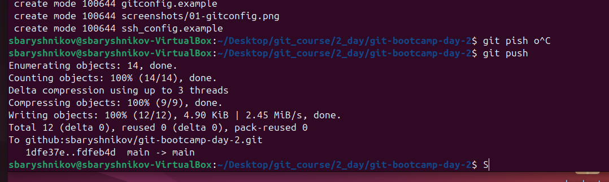
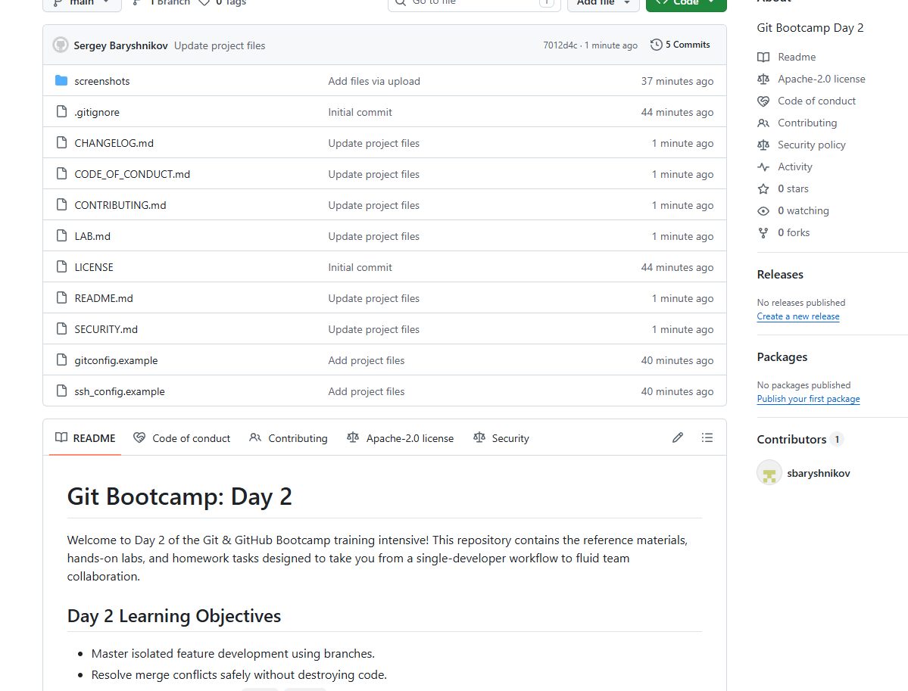

# LAB — день 2

Отчёт о выполнении домашнего задания дня 2 в рамках курса ["Интенсив по погружению в GIT"](https://slurm.io/git-intensive): настройка `gitconfig` и SSH, создание публичного репозитория, наполнение его служебными и стандартными файлами.

## Содержание

- [LAB — день 2](#lab--день-2)
  - [Содержание](#содержание)
  - [Настройка gitconfig](#настройка-gitconfig)
  - [SSH-ключ и подключение к GitHub](#ssh-ключ-и-подключение-к-github)
  - [Создание репозитория](#создание-репозитория)
  - [Служебные файлы](#служебные-файлы)
    - [`.gitignore`](#gitignore)
    - [`.gitattributes`](#gitattributes)
  - [Стандартные файлы и выбор лицензии](#стандартные-файлы-и-выбор-лицензии)
    - [Почему именно эта лицензия](#почему-именно-эта-лицензия)
  - [Markdown](#markdown)
  - [Финальный пуш](#финальный-пуш)

## Настройка gitconfig

Параметры user.name, user.email для оформления коммитов
core.editor - для выбора редактора по умолчанию
init.defaultBranch - чтобы задать название дефолтной ветки
алиасы основных операций команды git - status, checkout, commit, branch

Скриншот вывода `git config --global --list`:


Полный фрагмент моего конфига — в файле [`gitconfig.example`](gitconfig.example).

## SSH-ключ и подключение к GitHub

Использовал алгоритм `ed25519`, прописал в `~/.ssh/config` доменное имя сервера, дефолтного юзера для подключения, тип авторизации и путь к приватному ключу
Скриншот ответа GitHub на `ssh -T git@github.com`:



Фрагмент моего `~/.ssh/config` — в файле [`ssh_config.example`](ssh_config.example).

## Создание репозитория

Выбрал видимость Public. Выбрал создание файла README, автоматическую генерацию лицензии по выбранному типу, и .gitignore для выбранного стека

Скриншот свежесозданного репозитория:



## Служебные файлы

### `.gitignore`

Стек: `C++`. Выбрал, потому что изучал его очень давно, чтобы пройти собеседование.
Файл сгенерирован через интерфейс GitLab.

### `.gitattributes`

Минимум — `* text=auto` для нормализации переносов строк между macOS/Linux и Windows. Дополнительные правила:

```text
* text=auto
eol=lf
```

## Стандартные файлы и выбор лицензии

В корне лежат:

- [`README.md`](README.md) — визитка проекта.
- [`CHANGELOG.md`](CHANGELOG.md) — формат Keep a Changelog.
- [`LICENSE`](LICENSE) — выбранная лицензия.
- [`CONTRIBUTING.md`](CONTRIBUTING.md) — как контрибьютить.
- [`CODE_OF_CONDUCT.md`](CODE_OF_CONDUCT.md) — Contributor Covenant.
- [`SECURITY.md`](SECURITY.md) — политика раскрытия уязвимостей.

### Почему именно эта лицензия

Лицензия Apache License 2.0 для:

- Привлечение бизнеса. Корпорации охотно используют мой код, так как могут закрывать свои доработки
- Защита от патентных троллей. Встроенный патентный щит защищает меня и пользователей от судебных исков
- Безопасность автора. Снимаю с себя ответственность за любые ошибки в коде
- Сохранение авторства. Пользователи обязаны указывать моё имя и сохранять копию лицензии.

## Markdown

В этом отчёте и в `README.md` использованы:

- заголовки `H1`/`H2`/`H3`;
- оглавление в начале со ссылками на якоря;
- блоки кода с подсветкой (`bash`, `text`);
- сворачиваемый блок (см. ниже);
- ссылки на внешние URL.

<details>
<summary>Пример сворачиваемого блока (можно убрать после проверки)</summary>

```
2026-05-30 17:57:01 [INFO] core.AppLauncher - Initializing open-source component...
2026-05-30 17:57:02 [INFO] core.AppLauncher - License verified: Apache License 2.0
2026-05-30 17:57:02 [INFO] core.AppLauncher - Copyright (c) 2026 Developer Name. All rights reserved.
2026-05-30 17:57:03 [WARN] security.Patents - Patent grant enabled for downstream users.
2026-05-30 17:57:05 [INFO] core.AppLauncher - Component started successfully.
```
</details>

## Финальный пуш

Пушил в main, предупреждений GitLab не было

Терминал с пушем:



Главная страница репозитория после пуша:



